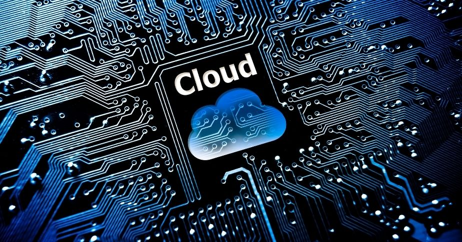

# Laboratorio 1 - Primeros Pasos

- [Laboratorio 1 - Primeros Pasos](#laboratorio-1---primeros-pasos)
  - [Objetivo](#objetivo)
  - [Herramientas a usar](#herramientas-a-usar)
  - [Proveedores de nube](#proveedores-de-nube)
  - [Procedimiento](#procedimiento)

## Objetivo

Por medio de la ejecución de este conjunto de actividades se espera afianzar los conceptos básicos de computación en la nube, familiarizarse con el entorno del proveedor de servicios de nube __CSP__ y empezar a realizar actividades de configuración.

## Herramientas a usar

A continuación se listan las herramientas a utilizar para el laboratorio:

1. Explorador de Internet de su preferencia (Chrome, Edge, o Firefox)
2. Acceso por Internet a uno de los proveedores de servicio de computación en la nube
3. Cliente para la conexión remota a equipos (Cliente de Escritorio Remoto - RDP)
4. Cliente para la conexión por SSH a equipos

## Proveedores de nube

Los proveedores de servicios de computación en la nube que pueden ser incluidos en el desarrollo de la asignatura son los siguientes:

| Nombre | Sitio Web | Logo |
| --- | --- | --- |
| Azure | <https://portal.azure.com/> | |
| Amazon Web Services (AWS) | <https://portal.aws.amazon.com/> |  |

## Procedimiento

Realizar el siguiente conjunto de actividades para el desarrollo del laboratorio.

> __Nota:__ Recuerde documentar por medio de pantallazos la ejecución de las diferentes actividades con el fin de realizar un documento que quede como evidencia del trabajo en equipo. Este documento es el que deberá ser cargado en el espacio de Google Classroom provisto para ello.

0. Responda las siguientes preguntas
   1. [__Chequeo 1__](https://learn.microsoft.com/es-mx/training/modules/describe-cloud-compute/7-knowledge-check?ns-enrollment-type=learningpath&ns-enrollment-id=learn.wwl.microsoft-azure-fundamentals-describe-cloud-concepts)
   2. [__Chequeo 2__](https://learn.microsoft.com/en-us/training/modules/describe-cloud-service-types/5-knowledge-check?ns-enrollment-type=learningpath&ns-enrollment-id=learn.wwl.microsoft-azure-fundamentals-describe-cloud-concepts)
1. Cree la cuenta en el CSP
   1. Video de guía de creación de cuenta. [Video](https://youtu.be/76tQZYm88JQ?si=YLLNVmUmFATWUAb_)
   2. Enlace de creación de [cuenta en Azure](https://azure.microsoft.com/es-es/pricing/purchase-options/azure-account)
   3. Enlace de creación de [cuenta en AWS](https://aws.amazon.com/free/)
2. Consola de gestión de servicios de Nube (management plane)
   1. [Administración de servicios con Azure Portal](https://learn.microsoft.com/es-mx/training/modules/tour-azure-portal/)
3. Creación de los usuarios
   1. [Administrar identidades de Microsoft Entra ID](./AZ-104-Labs/Instructions/Labs/LAB_01-Manage_Entra_ID_Identities.md)
   2. __Opcional__ [Creación de usuarios y grupos de Azure en Microsoft Entra ID](https://learn.microsoft.com/es-mx/training/modules/create-users-and-groups-in-azure-active-directory/)
4. Protección de los recursos con el control de acceso basado en roles
   1. [Administrar suscripciones y RBAC](./AZ-104-Labs/Instructions/Labs/LAB_02a_Manage_Subscriptions_and_RBAC_Entra.md)
   2. __Opcional__ [Protección de los recursos de Azure con el control de acceso basado en roles de Azure (Azure RBAC)](https://learn.microsoft.com/es-mx/training/modules/secure-azure-resources-with-rbac/)
5. Asegurando Acceso con MFA
   1. [Protección de usuarios de Microsoft Entra con autenticación multifactor](https://learn.microsoft.com/es-mx/training/modules/secure-aad-users-with-mfa/)
6. Autoservicio de usuarios
   1. [Permitir que los usuarios restablezcan sus contraseñas con el autoservicio de restablecimiento de contraseña de Microsoft Entra](https://learn.microsoft.com/es-mx/training/modules/allow-users-reset-their-password/)
7. Políticas de Gestión de Recursos
   1. [Administración de la gobernanza mediante Azure Policy](./AZ-104-Labs/Instructions/Labs/LAB_02b-Manage_Governance_via_Azure_Policy.md)
8. Gestión de recursos
   1. [Administración de recursos de Azure (Portal)](./AZ-104-Labs/Instructions/Labs/LAB_03a-Manage_Azure_Resources_by_Using_the_Azure_Portal.md)
   2. [Administración de recursos de Azure mediante Azure PowerShell](./AZ-104-Labs/Instructions/Labs/LAB_03c-Manage_Azure_Resources_by_Using_Azure_PowerShell.md)
9. Creación de Redes Virtuales
   1. [Implementación de redes virtuales](./AZ-104-Labs/Instructions/Labs/LAB_04-Implement_Virtual_Networking.md)