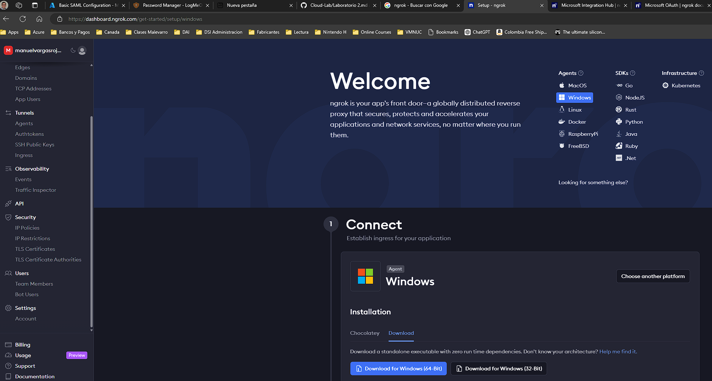
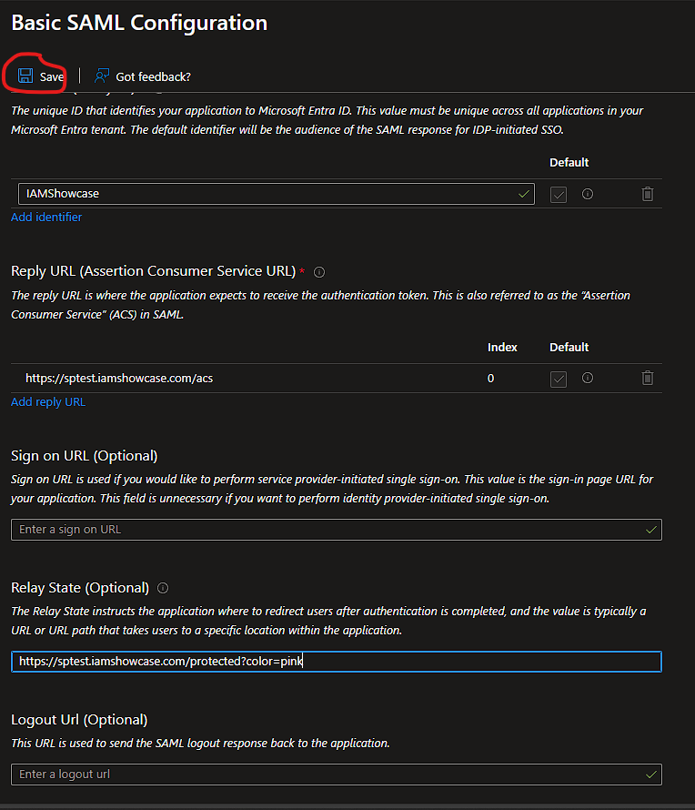
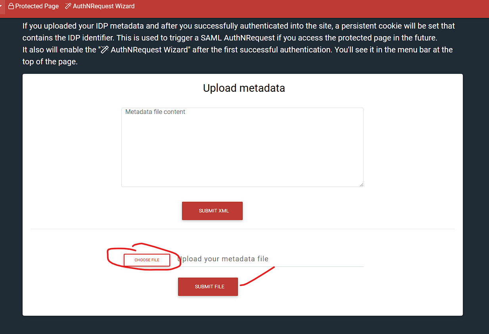
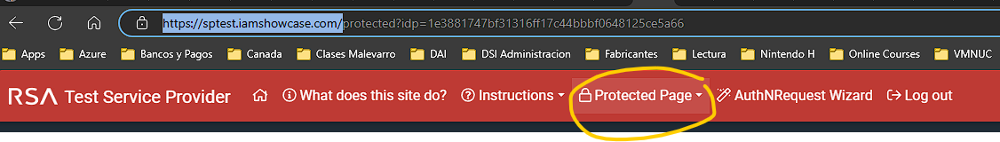
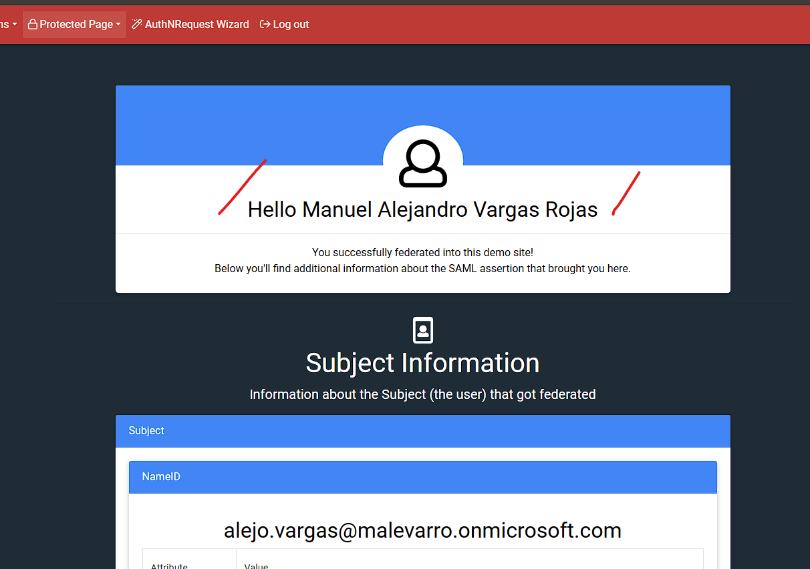
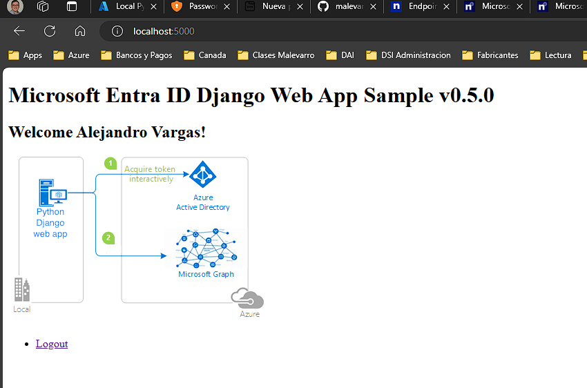
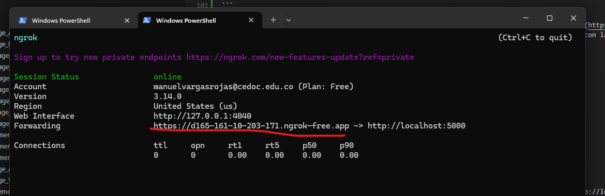
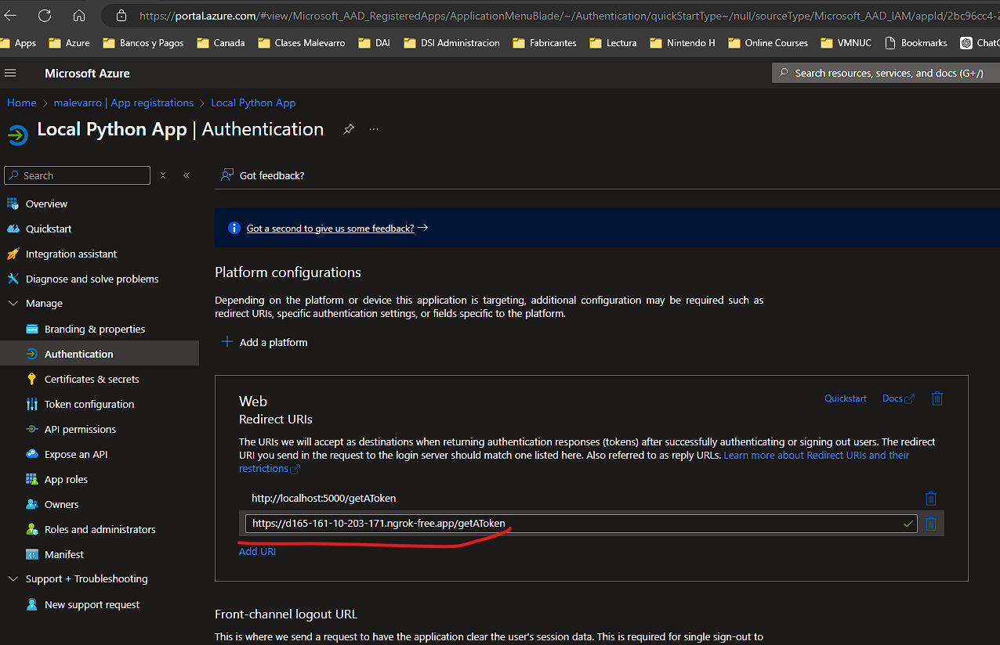
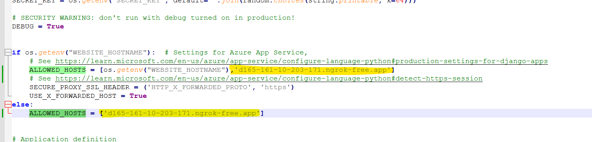
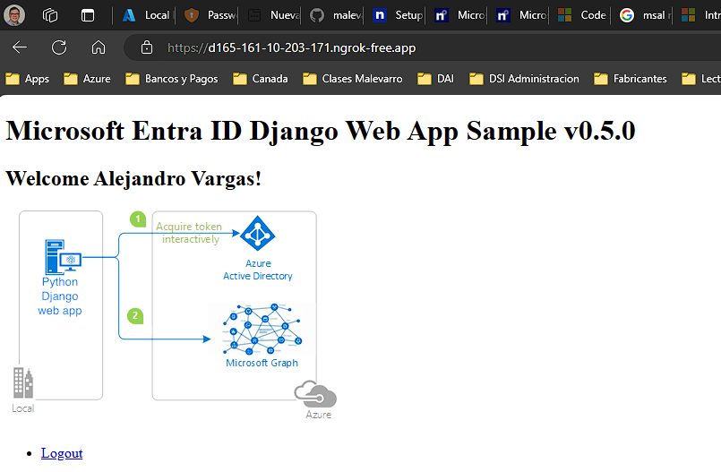

# Laboratorio 2 - Configuración Inicial de los Servicios


- [Laboratorio 2 - Configuración Inicial de los Servicios](#laboratorio-2---configuración-inicial-de-los-servicios)
  - [Objetivo](#objetivo)
  - [Herramientas a usar](#herramientas-a-usar)
    - [Herramientas Adicionales](#herramientas-adicionales)
  - [Procedimiento](#procedimiento)
    - [Integración de aplicaciones](#integración-de-aplicaciones)
      - [Preparación del ambiente](#preparación-del-ambiente)
      - [Integración vía SAML](#integración-vía-saml)
      - [Integración vía OIDC (OAuth)](#integración-vía-oidc-oauth)
    - [Implementación de redes virtuales](#implementación-de-redes-virtuales)

## Objetivo

Por medio de la ejecución de este conjunto de actividades se espera afianzar los conceptos de despliegue de componentes en un __CSP__ e ir aplicando elementos de seguridad.

## Herramientas a usar

A continuación se listan las herramientas a utilizar para el laboratorio:

| Nombre | Sitio Web | Logo |
| --- | --- | --- |
| Azure | <https://portal.azure.com/> | |
| Visual Studio Code | <https://code.visualstudio.com/download> |  |
| GIT for Windows | <https://gitforwindows.org/> | |
| Python for Windows | <https://www.python.org/> | |
| ngrok | <https://ngrok.com/> | |

### Herramientas Adicionales

1. Explorador de Internet de su preferencia (Chrome, Edge, o Firefox)
2. Acceso por Internet a uno de los proveedores de servicio de computación en la nube
3. Cliente para la conexión remota a equipos (Cliente de Escritorio Remoto - RDP)
4. Cliente para la conexión por SSH a equipos

> __Nota:__ Estas herramientas deben estar instaladas en el equipo o en una máquina virtual de trabajo

## Procedimiento

Realizar el siguiente conjunto de actividades para el desarrollo del laboratorio.

> __Nota:__ Recuerde documentar por medio de pantallazos la ejecución de las diferentes actividades con el fin de realizar un documento que quede como evidencia del trabajo en equipo. Este documento es el que deberá ser cargado en el espacio de Google Classroom provisto para ello.

### Integración de aplicaciones

En este laboratorio se espera poder realizar la integración de una aplicación __dummy__ para ser autenticada con el directorio de su Tenant de Azure

#### Preparación del ambiente

Ejecute los siguientes pasos en su equipo o en alguna máquina virtual para el despliegue de las aplicaciones.

1. Vaya a al sitio web de [ngrok](https://ngrok.com/)
2. Realice la creación de una cuenta en el [sitio web](https://dashboard.ngrok.com/signup)
3. En el sitio web seleccione la plataforma o sistema operativo que desea usar (ej. Windows)



4. Descargue el ejecutable de la aplicación. Descomprima el archivo en una carpeta de fácil acceso por terminal (ej. c:\apps).
5. Abra una línea de comando y ejecute los siguientes comandos:

```powershell
cd c:\apps
.\ngrok.exe config add-authtoken "token_entregado_en_sitio_web"
```

#### Integración vía SAML

   1. Verifique que tenga acceso al sitio web de la aplicación [Test Service Provider](https://sptest.iamshowcase.com/)
   2. En la página web diríjase a la sección de [instrucciones](https://sptest.iamshowcase.com/instructions)
   3. Descargue el archivo que se le indica en el botón de [Download Metadata](https://sptest.iamshowcase.com/testsp_metadata.xml); guarde ese archivo ya que se usará mas adelante
   4. Ejecute los pasos indicados en alguna de las siguientes guías:
      1. [Guía de referencia 1](https://boxyhq.com/docs/jackson/sso-providers/azure) de los pasos a seguir en la configuración de una aplicación empresarial vía __SAML__
      2. [Guía de referencia 2](https://docs.digicert.com/en/trust-lifecycle-manager/how-to-guides/configure-a-profile-to-authenticate-requests-via-saml-2-0-using-microsoft-azure-ad-saml-idp/create-saml-idp-applications-in-azure-ad-portal.html).

   > __Nota__: Recuerde hacer uso del archivo de metadatos que descargo en los pasos anteriores. En la __guía de referencia 2__ no ejecutar los pasos descritos del 15 al 19.

   5. Una vez cargue el archivo de metadatos, en la ventana que se indica a continuación, busque la sección de __Relay State (Optional)__ y coloque el siguiente valor: __https://sptest.iamshowcase.com/protected?color=pink__. Recuerde luego de ingresar el parámetro de guardar la configuración.
    
   6. Guarde el archivo de metadatos que descargo del portal de Azure y realice la carga en la página de la aplicación de prueba [aquí](https://sptest.iamshowcase.com/instructions#spinit)
    
   7. Luego de cargar todo, haga click en la opción que dice __Protected Page__. Aquí la aplicación va a solicitar que se autentique con algún usuario que esté creado en su directorio.
    
   8. Si todo esta correcto, usted será redirigido a una página que contiene toda la información del usuario
    

#### Integración vía OIDC (OAuth)

1. Desde una terminal de comandos en el equipo ejecute los siguientes comandos

```powershell
mkdir c:\apps
cd c:\apps
git clone https://github.com/Azure-Samples/ms-identity-python-webapp-django.git
cd c:\apps\ms-identity-python-webapp-django
pip install -r requirements.txt
python manage.py migrate
cp .\.env.sample.entra-id .\.env
```

2. En la consola de Azure, ejecute los pasos 1, 2 y 3 que se indican en la siguiente [guía](https://learn.microsoft.com/es-mx/entra/identity-platform/quickstart-web-app-python-flask?tabs=windows)
3. Con la ayuda de Visual Studio Code o Notepad++ abra el archivo __.env__ que creo en la ruta con la ayuda de los comandos anteriores y modifique su contenido de la siguiente manera

```properties
AUTHORITY=https://login.microsoftonline.com/"Valor_De_TenantID"
CLIENT_ID="el_código_que_sale_en_EntraID"
CLIENT_SECRET="El_valor_del_secreto_creado"
REDIRECT_URI=http://localhost:5000/getAToken
SCOPE=User.Read
ENDPOINT=https://graph.microsoft.com/v1.0/me
```

4. Ejecute el siguiente comando para correr la aplicación

```powershell
python manage.py runserver localhost:5000
```

5. En el navegador de Internet de su preferencia, abra el sitio [http://localhost:5000](http://localhost:5000)
6. Si todo esta correcto le pedirá la autenticación de su usuario y verá la siguiente página web



7. Ahora vamos a publicar la aplicación por medio de un proxy reverso. Para esto se debe ejecutar el servicio de __ngrok__ en la ruta donde se descargó en los pasos anteriores. Desde la linea de comandos ejecutar lo siguiente:

```powershell
cd c:\apps
.\ngrok.exe http http://localhost:5000 
```

8. Con el servicio en ejecución se debe verificar cuál es la URL que ha sido entregada para la aplicación



9. Adicione la URL encontrada en el registro de la aplicación hecho en EntraID



10. Con la ayuda de Visual Studio Code o Notepad++ abra el archivo __.env__ y modifique el valor de la propiedad "REDIRECT_URI". Debe quedar el archivo de la siguiente manera:

```properties
AUTHORITY=https://login.microsoftonline.com/"Valor_De_TenantID"
CLIENT_ID="el_código_que_sale_en_EntraID"
CLIENT_SECRET="El_valor_del_secreto_creado"
REDIRECT_URI=https://"REEMPLAZAR_POR_SU_URL".ngrok-free.app/getAToken
SCOPE=User.Read
ENDPOINT=https://graph.microsoft.com/v1.0/me
```

11. Modifique el archivo de configuración del servidor web de Python para incluir la URL generada en __ngrok__; para esto debe ir a modificar el archivo _settings.py_. Este archivo esta en la ruta en donde descargo la aplicación con la ayuda de __Git__, para el caso de ejemplo de este laboratorio la ruta sería _c:\apps\ms-identity-python-webapp-django\mysite\settings.py_. En el archivo es necesario modificar los valores de la variable __ALLOWED_HOSTS__ con la URL que usted obtuvo de __ngrok__. un ejemplo es el siguiente:



12. En la terminal de linea de comando en donde esta ejecutándose el __Python__ se debe para el proceso con _CTRL+C_ y se debe relanzar la tarea con el siguiente comando

```powershell
cd c:\apps
.\ngrok.exe http http://localhost:5000 
```

13. Una vez realizada esta configuración podrá ingresar a la aplicación desde cualquier navegador por medio de la URL de la herramienta de __ngrok__



### Implementación de redes virtuales

En este laboratorio de realizará la implementación de las definiciones de redes virtuales (VNET's o VCN's), se realizarán interconexiones entre ellas y finalmente se hará prueba de una topología de Hub and Spoke. Ejecute los pasos indicados en las siguientes guías:

   1. [Implementación de redes virtuales en Azure](https://microsoftlearning.github.io/AZ-104-MicrosoftAzureAdministrator/Instructions/Labs/LAB_04-Implement_Virtual_Networking.html)
   2. [Interconexión entre redes virtuales en Azure](https://microsoftlearning.github.io/AZ-104-MicrosoftAzureAdministrator/Instructions/Labs/LAB_05-Implement_Intersite_Connectivity.html)
   3. [Configuración avanzada del tráfico de red en Azure](https://microsoftlearning.github.io/AZ-104-MicrosoftAzureAdministrator/Instructions/Labs/LAB_06-Implement_Network_Traffic_Management.html)

> __Nota:__ Recuerde realizar y documentar todos los ejercicios de una manera clara y adecuada.
