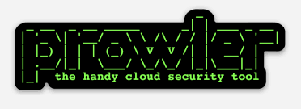
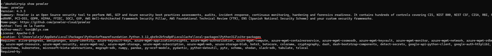
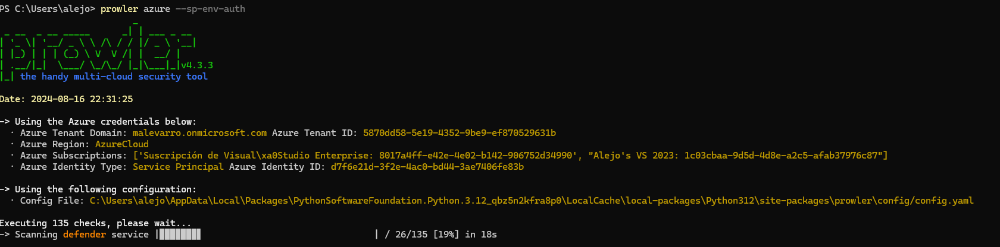
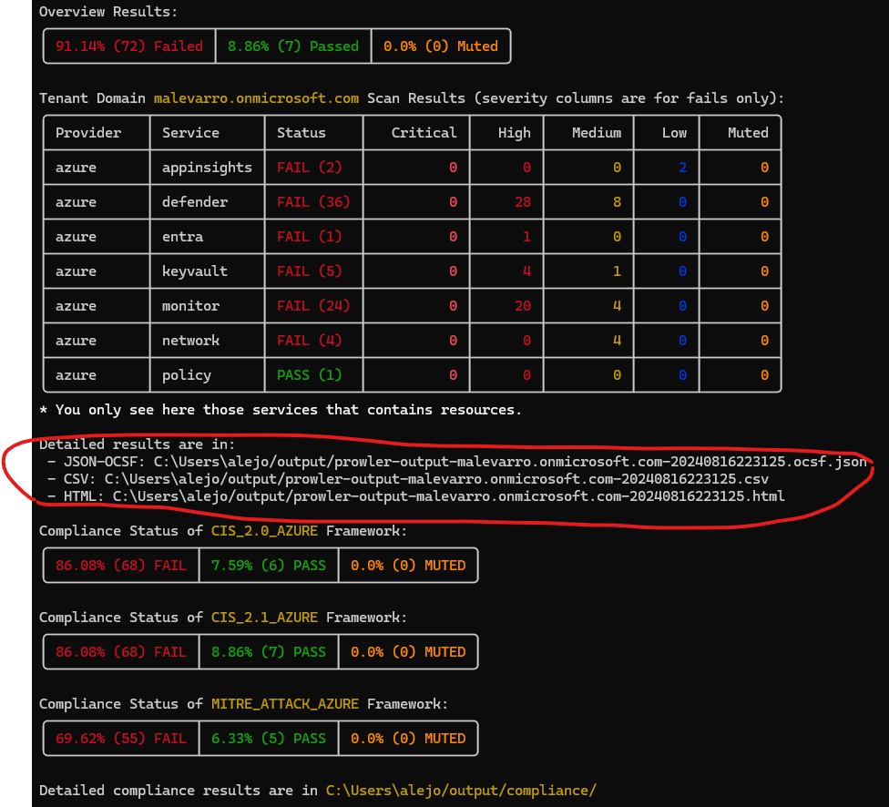
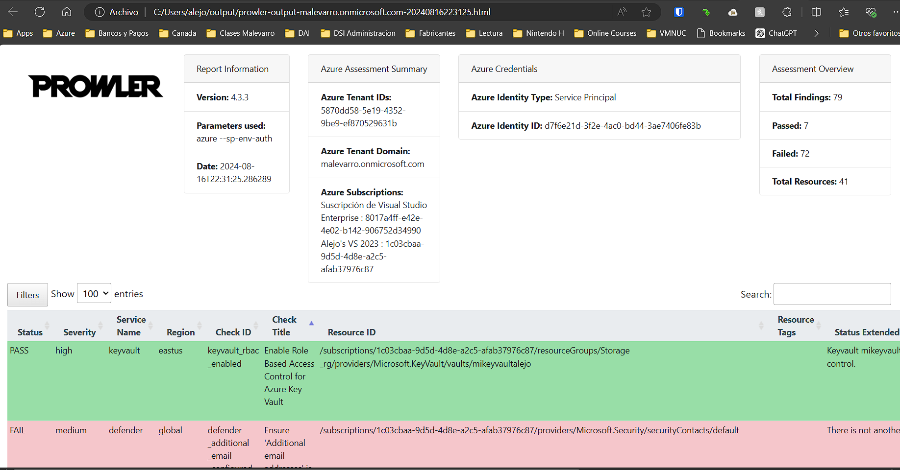
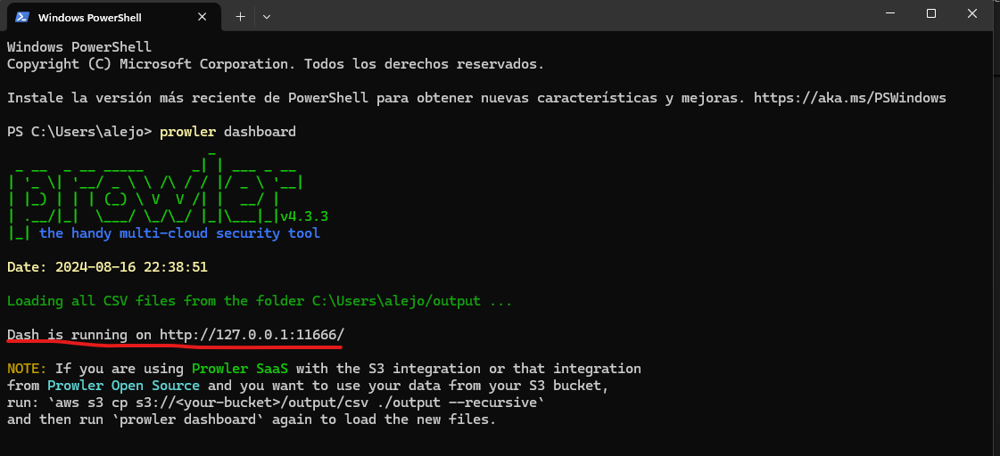
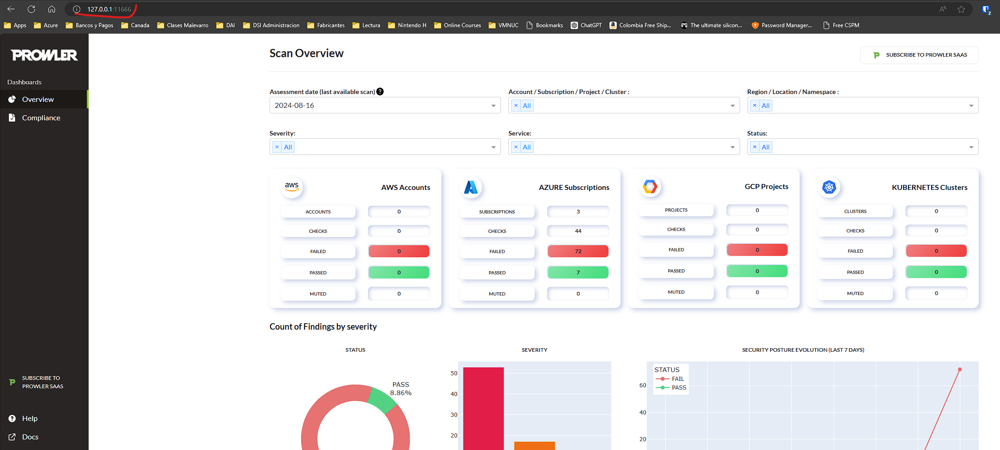
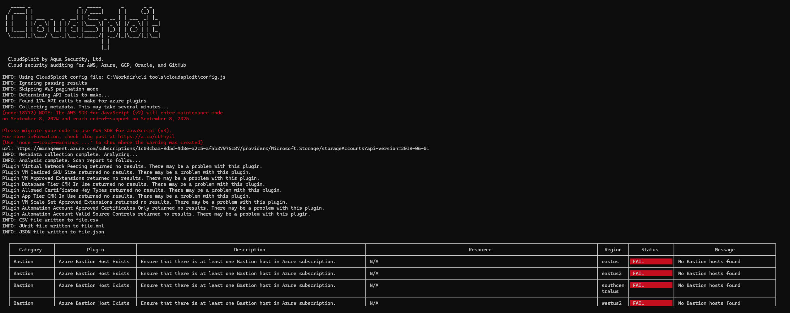
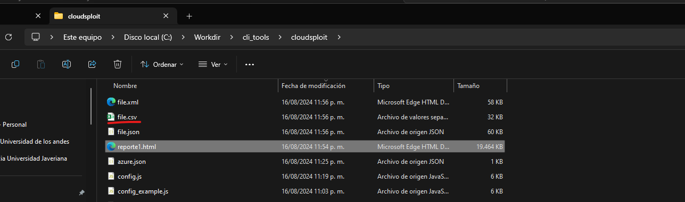
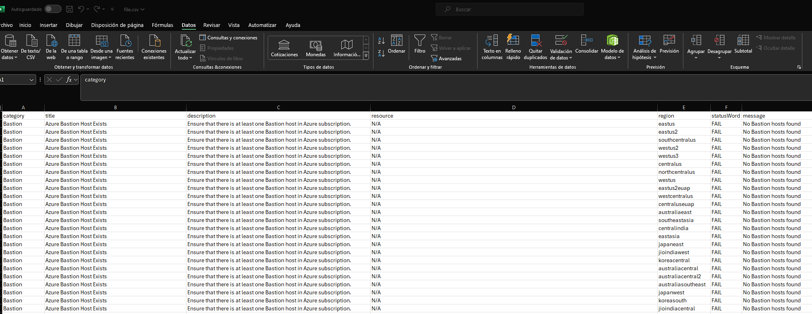

# Laboratorio 3 - Configuración Inicial de Seguridad


- [Laboratorio 3 - Configuración Inicial de Seguridad](#laboratorio-3---configuración-inicial-de-seguridad)
  - [Objetivo](#objetivo)
  - [Herramientas a usar](#herramientas-a-usar)
    - [Herramientas Adicionales](#herramientas-adicionales)
  - [Procedimiento](#procedimiento)
    - [Laboratorios de seguridad](#laboratorios-de-seguridad)
    - [Integración de Herramientas de Postura de Seguridad -  Cloud Security Posture Management (CSPM)](#integración-de-herramientas-de-postura-de-seguridad----cloud-security-posture-management-cspm)
      - [Prowler](#prowler)
      - [Cloudsploit](#cloudsploit)
  - [Fin del procedimiento](#fin-del-procedimiento)

## Objetivo

Por medio de la ejecución de este conjunto de actividades se espera afianzar los conceptos de despliegue de componentes en un __CSP__ e ir aplicando elementos de seguridad.

## Herramientas a usar

A continuación se listan las herramientas a utilizar para el laboratorio:

| Nombre | Sitio Web | Logo |
| --- | --- | --- |
| Azure | <https://portal.azure.com/> | |
| Python for Windows | <https://www.python.org/> | |
| Prowler | <https://github.com/prowler-cloud/prowler> |  |
| node.js| <https://nodejs.org/en> |  |
| CloudSploit | <https://github.com/aquasecurity/cloudsploit> |  |

### Herramientas Adicionales

1. Explorador de Internet de su preferencia (Chrome, Edge, o Firefox)
2. Acceso por Internet a uno de los proveedores de servicio de computación en la nube
3. Cliente para la conexión remota a equipos (Cliente de Escritorio Remoto - RDP)
4. Cliente para la conexión por SSH a equipos

## Procedimiento

Realizar el siguiente conjunto de actividades para el desarrollo del laboratorio.

> __Nota:__ Recuerde documentar por medio de pantallazos la ejecución de las diferentes actividades con el fin de realizar un documento que quede como evidencia del trabajo en equipo. Este documento es el que deberá ser cargado en el espacio de Google Classroom provisto para ello.

### Laboratorios de seguridad

Siga los pasos que se indican en cada una de las siguientes guías

1. [Laboratorio 3.1](./Labs/Laboratorio%203-1.pdf)
2. [Laboratorio 3.2](./Labs/Laboratorio%203-2.pdf)
3. [Laboratorio 3.3](./Labs/Laboratorio%203-3.pdf)
4. [Laboratorio 3.4](./Labs/Laboratorio%203-4.pdf)
5. [Laboratorio 3.5](./Labs/Laboratorio%203-5.pdf)
6. [Laboratorio 3.6](./Labs/Laboratorio%203-6.pdf)

### Integración de Herramientas de Postura de Seguridad -  Cloud Security Posture Management (CSPM)

#### Prowler

1. Desde una terminal de comandos ejecute el siguiente comando

```bat
pip install prowler
prowler -v
```

> __Nota:__ Si al ejecutar el segundo comando le indican que Prowler no es un valor o variable conocido es necesario verificar la ruta de instalación del ejecutable y adicionar la ruta al _PATH_ del sistema operativo. Para hacer esto ejecute el siguiente procedimiento:

- En una terminal ejecute el siguiente comando:

```bat
pip show prowler
```

En la salida del comando verifique el valor de la variable _Location_. Este es el valor que debe adicionar al path del sistema siguiendo la siguiente [guía](https://www.neoguias.com/agregar-directorio-path-windows/).



2. En la consola de Azure, ejecute los que se indican en la siguiente [guía](https://github.com/aquasecurity/cloudsploit/blob/master/docs/azure.md)

> __Nota:__ Colocar como nombre de la aplicación _Prowler_. Recuerde realizar la creación del secreto y copiarlo en un archivo de texto.

3. Asigne un rol de _Reader_ sobre toda la suscripción como se muestra en el siguiente [video](https://www.youtube.com/watch?v=9n70ZDVlL3c)

4. Desde la linea de comando adicionar las siguientes variables de sistema para poder ejecutar la herramienta

  _Si es una terminal cmd normal_

```bat
set AZURE_CLIENT_ID="__valor de appid en EntraID__"
set AZURE_TENANT_ID="__Identificado Único en EntraID__"
set AZURE_CLIENT_SECRET="__Secreto Generado en pasos anteriores__"
```

  _Si es en una terminal Powershell_

```powershell
$env:AZURE_CLIENT_ID="__valor de appid en EntraID__"
$env:AZURE_TENANT_ID="__Identificado Único en EntraID__"
$env:AZURE_CLIENT_SECRET="__Secreto Generado en pasos anteriores__"
```

5. Ejecute el análisis de su entorno con el siguiente comando

```powershell
prowler azure --sp-env-auth
```

6. Espere a que se ejecute el análisis del entorno



7. Al finalizar el análisis le indicara el cuadro de incumplimiento y las rutas en donde puede encontrar los archivos de los resultados para verificar de una mejor manera.



8. Abra el archivo HTML en un explorador y verifique los resultados



9. En una terminal de comandos ejecute el siguiente comando

```powershell
prowler dashboard
```

10. En la salida del comando verifique la dirección que le indica para que sea abierta desde un navegador de Internet



11. En el navegador abra el sitio web y verifique la información que le presentan



#### Cloudsploit

Para la ejecución de este laboratorio es necesario realizar la instalación de la herramienta siguiendo los siguientes pasos:

> __Nota:__ Para esta instalación es necesario contar con Node.JS instalado en el equipo.

1. Desde una terminal de comandos en el equipo ejecute los siguientes comandos

```powershell
mkdir c:\apps
cd c:\apps
git git clone https://github.com/aquasecurity/cloudsploit.git
cd c:\apps\cloudsploit
npm install
node index.js -h
```

1. En la consola de Azure, ejecute los que se indican en la siguiente [guía](https://github.com/aquasecurity/cloudsploit/blob/master/docs/azure.md).


>__Nota:__ Recuerde realizar la creación del secreto y copiarlo en un archivo de texto.

3. En el portal de Azure vaya a las suscripciones activas que posee. para hacer esto en la barra superior del centro coloque la palabra suscripciones, luego seleccione la llave que aparece.


4. Sobre el listado que aparece, haga click la suscripción e ingrese sobre las propiedades. Vaya a la sección de control de acceso (IAM) y allí haga clic en el botón de agregar-> agregar asignación de rol


5. Una vez allí seleccione el rol de __Reader__ y de __Key Vault Administrator__. Sobre el EntraID se debe colocar el rol de __Global Reader__


6. En la siguiente pantalla va a hacer click en _Seleccionar Miembros_ en la ventana inicia a buscar el nombre de la aplicación que creo anteriormente, luego seleccione la identidad de la aplicación y haga clic en _Seleccionar_


7. En la ruta de descarga e instalación de la herramienta se debe crear un nuevo archivo llamado __config.js__. Para ello ejecute el siguiente comando:

```powershell
cd c:\apps\cloudsploit
cp config_example.js config.js
```

8. En el contenido del archivo es necesario buscar la sección correspondiente a Azure y modificar su contenido con la siguiente información:

```javascript
....
        azure: {
            // OPTION 1: If using a credential JSON file, enter the path below
            credential_file: './azure.json',
            // OPTION 2: If using hard-coded credentials, enter them below
            // application_id: process.env.AZURE_APPLICATION_ID || '',
            // key_value: process.env.AZURE_KEY_VALUE || '',
            //directory_id: process.env.AZURE_DIRECTORY_ID || '',
            // subscription_id: process.env.AZURE_SUBSCRIPTION_ID || '',
            // storage_connection: process.env.AZURE_STORAGE_CONNECTION || '',
            // blob_container: process.env.AZURE_BLOB_CONTAINER || '',
            // govcloud: process.env.AZURE_GOV_CLOUD || ''
        },
....
```

9. En la ruta de instalación donde se encuentra el archivo __config.js__ es necesario realizar la creación de un archivo llamado __azure.json__ y su contenido debe ser el siguiente

```json
{
  "ApplicationID": "__valor de appid en EntraID__",
  "KeyValue": "__Secreto Generado en pasos anteriores__",
  "DirectoryID": "__Identificado Único en EntraID__",
  "SubscriptionID": "__El valor de la suscripción que puede ser consultado en Azure__"
}
```

10. Ejecute el siguiente comando para correr la aplicación contra su configuración

```powershell
node index.js --config="c:\apps\cloudsploit\config.js" --cloud=azure --json=file.json --junit=file.xml --csv=file.csv --console=table --ignore-ok
```

11. Espere a que termine de realizar el escaneo y observe los resultados



12. En la ruta de la aplicación _Ej.: c:\apps\cloudsploit_ se crean un archivo csv que puede ser usado para abrir en excel los resultados



13. Verifique en Excel los resultado obtenidos abriendo el archivo.



## Fin del procedimiento

Recuerde documentar de manera adecuada la ejecución de los laboratorios.
