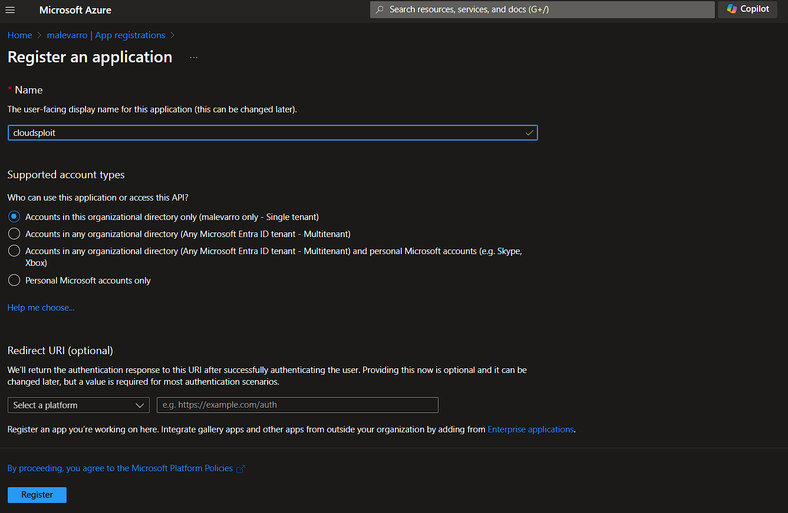
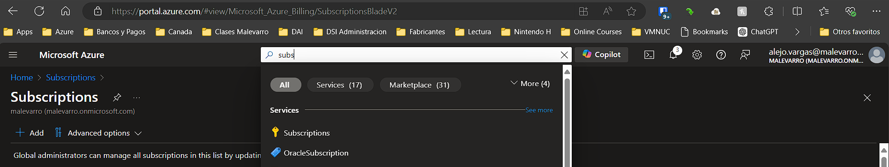
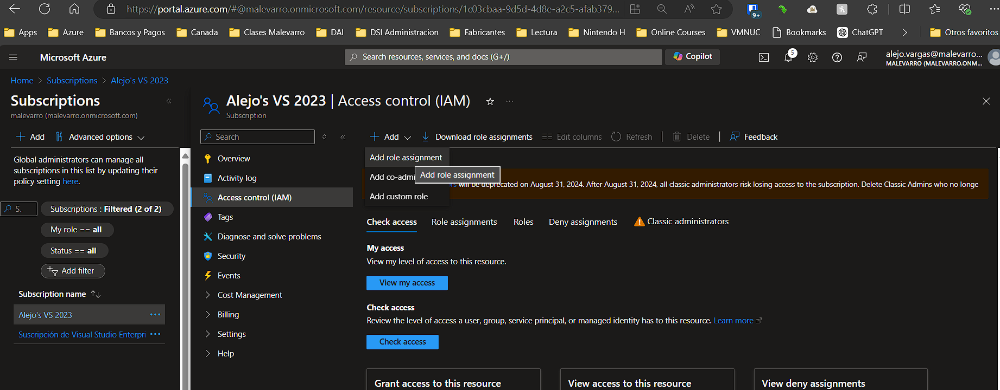
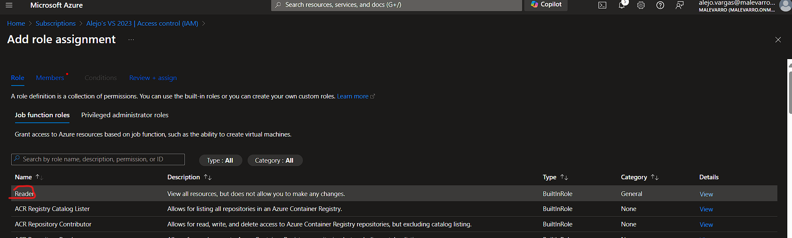
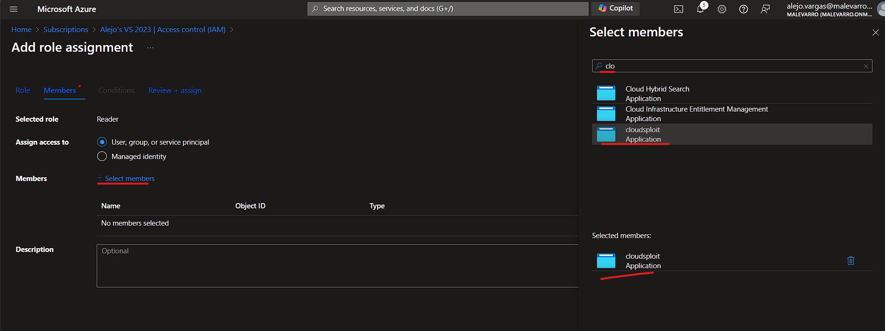

# Laboratorio 3 - Configuración Inicial de Seguridad


- [Laboratorio 3 - Configuración Inicial de Seguridad](#laboratorio-3---configuración-inicial-de-seguridad)
  - [Objetivo](#objetivo)
  - [Herramientas a usar](#herramientas-a-usar)
    - [Herramientas Adicionales](#herramientas-adicionales)
  - [Procedimiento](#procedimiento)
    - [Laboratorios de seguridad](#laboratorios-de-seguridad)
    - [Integración de Herramientas de Postura de Seguridad -  Cloud Security Posture Management (CSPM)](#integración-de-herramientas-de-postura-de-seguridad----cloud-security-posture-management-cspm)
      - [Cloudsploit](#cloudsploit)

## Objetivo

Por medio de la ejecución de este conjunto de actividades se espera afianzar los conceptos de despliegue de componentes en un __CSP__ e ir aplicando elementos de seguridad.

## Herramientas a usar

A continuación se listan las herramientas a utilizar para el laboratorio:

| Nombre | Sitio Web | Logo |
| --- | --- | --- |
| Azure | <https://portal.azure.com/> | |
| node.js| <https://nodejs.org/en> |  |
| CloudSploit | <https://github.com/aquasecurity/cloudsploit> | 

### Herramientas Adicionales

1. Explorador de Internet de su preferencia (Chrome, Edge, o Firefox)
2. Acceso por Internet a uno de los proveedores de servicio de computación en la nube
3. Cliente para la conexión remota a equipos (Cliente de Escritorio Remoto - RDP)
4. Cliente para la conexión por SSH a equipos

## Procedimiento

Realizar el siguiente conjunto de actividades para el desarrollo del laboratorio.

> __Nota:__ Recuerde documentar por medio de pantallazos la ejecución de las diferentes actividades con el fin de realizar un documento que quede como evidencia del trabajo en equipo. Este documento es el que deberá ser cargado en el espacio de Google Classroom provisto para ello.

### Laboratorios de seguridad

Siga los pasos que se indican en cada una de las siguientes guías

1. [Laboratorio 3.1](./Labs/Laboratorio%203-1.pdf)
2. [Laboratorio 3.2](./Labs/Laboratorio%203-2.pdf)
3. [Laboratorio 3.3](./Labs/Laboratorio%203-3.pdf)
4. [Laboratorio 3.4](./Labs/Laboratorio%203-4.pdf)
5. [Laboratorio 3.5](./Labs/Laboratorio%203-5.pdf)
6. [Laboratorio 3.6](./Labs/Laboratorio%203-6.pdf)

### Integración de Herramientas de Postura de Seguridad -  Cloud Security Posture Management (CSPM)

#### Cloudsploit

Para la ejecución de este laboratorio es necesario realizar la instalación de la herramienta siguiendo los siguientes pasos:

> __Nota:__ Para esta instalación es necesario contar con Node.JS instalado en el equipo.

1. Desde una terminal de comandos en el equipo ejecute los siguientes comandos

```powershell
mkdir c:\apps
cd c:\apps
git git clone https://github.com/aquasecurity/cloudsploit.git
cd c:\apps\cloudsploit
npm install
./index.js -h
```

2. En la consola de Azure, ejecute los pasos 1 y 2 que se indican en la siguiente [guía](https://learn.microsoft.com/es-mx/entra/identity-platform/quickstart-web-app-python-flask?tabs=windows). En este caso no es necesario colocar ninguna URL al momento de crear la aplicación en EntraID, el valor puede ser vacío.



>__Nota:__ Recuerde realizar la creación del secreto y copiarlo en un archivo de texto.

3. En el portal de Azure vaya a las suscripciones activas que posee. para hacer esto en la barra superior del centro coloque la palabra suscripciones, luego seleccione la llave que aparece.



4. Sobre el listado que aparece, haga click la suscripción e ingrese sobre las propiedades. Vaya a la sección de control de acceso (IAM) y allí haga clic en el botón de agregar-> agregar asignación de rol



5. Una vez allí seleccione el rol de __Reader__ o __Lector Global__



6. En la siguiente pantalla va a hacer click en _Seleccionar Miembros_ en la ventana inicia a buscar el nombre de la aplicación que creo anteriormente, luego seleccione la identidad de la aplicación y haga clic en _Seleccionar_



Verifique el procedimiento de asignación con el siguiente [video](https://www.youtube.com/watch?v=9n70ZDVlL3c)

7. En la ruta de descarga e instalación de la herramienta se debe crear un nuevo archivo llamado __config.js__. como contenido de ese archivo se deben colocar las siguientes líneas

```javascript
module.exports = {
    credentials: {
        azure: {
            application_id: process.env.AZURE_APPLICATION_ID || '_Identificador_de_la_aplicacion',
            key_value: process.env.AZURE_KEY_VALUE || '_secreto_creado_',
            directory_id: process.env.AZURE_DIRECTORY_ID || '_Identificador_del_Tenant_',
            // subscription_id: process.env.AZURE_SUBSCRIPTION_ID || '',
        }
    }
};
```

8. Ejecute el siguiente comando para correr la aplicación contra su configuración

```powershell
./index.js --console=text
```
