# Laboratorio 4 - - Implementación de DevSecOps


- [Laboratorio 4 - - Implementación de DevSecOps](#laboratorio-4-----implementación-de-devsecops)
  - [Objetivo](#objetivo)
  - [Herramientas a usar](#herramientas-a-usar)
    - [Herramientas Adicionales](#herramientas-adicionales)
  - [Requisitos](#requisitos)
    - [Creación de cuentas en los servicios en línea de las herramientas](#creación-de-cuentas-en-los-servicios-en-línea-de-las-herramientas)
    - [Creación del entorno de Azure DevOps](#creación-del-entorno-de-azure-devops)
    - [Activar paralelismo](#activar-paralelismo)
    - [Instalación de extensiones en Azure DevOps](#instalación-de-extensiones-en-azure-devops)
    - [Establecer Service connection Con Azure](#establecer-service-connection-con-azure)
  - [Procedimiento](#procedimiento)
    - [Laboratorios de seguridad](#laboratorios-de-seguridad)
      - [Configurando elementos de Azure](#configurando-elementos-de-azure)
      - [Configurando elementos en Azure DevOps](#configurando-elementos-en-azure-devops)
      - [Establecer Service connection Con Azure](#establecer-service-connection-con-azure-1)
        - [Azure Container Registry (ACR)](#azure-container-registry-acr)
        - [GitHub](#github)
        - [Snyk Secure Scan](#snyk-secure-scan)
        - [SonarCloud](#sonarcloud)
    - [Adicionando variables de conexiones](#adicionando-variables-de-conexiones)
    - [Creando mi primer _Pipeline(Canalización)_](#creando-mi-primer-pipelinecanalización)

---

## Objetivo

En este laboratorio se tienen los siguientes objetivos

1. Realizar el flujo completo de creación y despliegue de una aplicación en contenedores con ayuda de las herramientas automatizadas
2. Incluir elementos de análisis de seguridad dentro de flujo automatizado de despliegue

---

## Herramientas a usar

Para la ejecución de los siguientes laboratorio se hará uso de las siguientes herramientas

| Nombre | Dirección Web | Logo |
|---------|---------|---------|
| Azure | <https://portal.azure.com>|  |
| Azure DevOps | <https://dev.azure.com> | 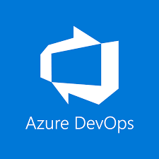 |
| Snyk | <https://app.snyk.io/login> | 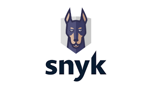|
| Sonarcloud | <https://sonarcloud.io/login> |  |
| Trivy | <https://trivy.dev/> | 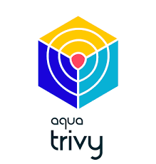 |
| Mend | <https://www.mend.io/> |  |
| .NET Framework 6.0 | <https://dotnet.microsoft.com/es-es/download/dotnet/6.0> |  |
| Visual Studio Code | <https://code.visualstudio.com/download> |  |
| GIT for Windows | <https://gitforwindows.org/> | |
| node.js| <https://nodejs.org/en> |  |
| Checkov | <https://www.checkov.io/> |  |

---

### Herramientas Adicionales

1. Explorador de Internet de su preferencia (Chrome, Edge, o Firefox)
2. Acceso por Internet a uno de los proveedores de servicio de computación en la nube

---

## Requisitos

Para la ejecución del laboratorio es indispensable realizar los siguientes pasos para poder continuar

---

### Creación de cuentas en los servicios en línea de las herramientas

1. Vaya la página de [GitHub](https://github.com/) y realice la creación de una cuenta con la ayuda de un correo personal, siga los pasos que le sean indicados.
2. Ya con la cuenta de GitHub creada, abra en el mismo navegador en pestañas independientes los siguientes repositorios:
   1. <https://github.com/malevarro/reactjs-shopping-cart>
   2. <https://github.com/MicrosoftDocs/mslearn-tailspin-spacegame-web>

3. Siga las instrucciones de la siguiente guía para realizar la copia (Fork/Bifurcación) de cada uno de los repositorios a su cuenta de GitHub

   - [Bifurcar (Fork) un repositorio](https://docs.github.com/es/get-started/quickstart/fork-a-repo?tool=webui)

4. Una vez haya creado la cuenta en GitHub ingrese a las siguientes URL en el mismo navegador en pestañas diferentes y seleccione la opción de registro con __GitHub__ y de esta forma integrar todas los servicios bajo una misma cuenta.

   | Aplicación | URL de Registro |
   | --- | --- |
   | Snyk | <https://app.snyk.io/login> |
   | Sonarcloud | <https://sonarcloud.io/login> |

---

### Creación del entorno de Azure DevOps

> __NOTA:__ Recuerde crear el registro en todo los servicios con la misma cuenta que tiene para Azure.

1. Vaya a la siguiente pagina que indica el procedimiento de registro de [Azure DevOps](https://www.devjev.nl/posts/2022/how-to-create-an-organization-in-azure-devops/#what-is-an-azure-devops-organization)
2. Siga los pasos indicados en el video.
3. Una vez registrados en Azure DevOps, abra el [Portal de Azure](https://portal.azure.com)
4. Dentro del portal haga la búsqueda de  Azure DevOps Organizations

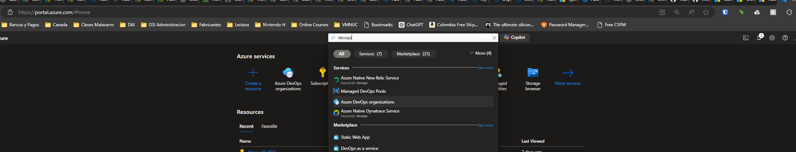

5. En la nueva ventana haga clic en _My Azure DevOps Organizations_

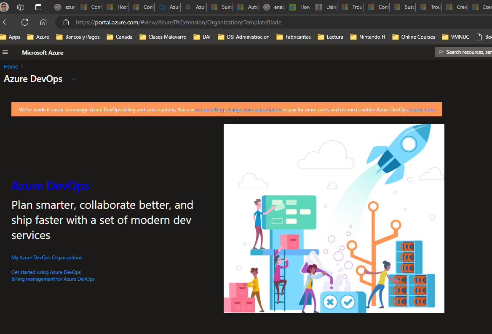

6. En la nueva ventana verifique que en la sección de _Azure DevOps Organizations_ exista alguna, haga click encima de ella para entrar a configurar su entorno

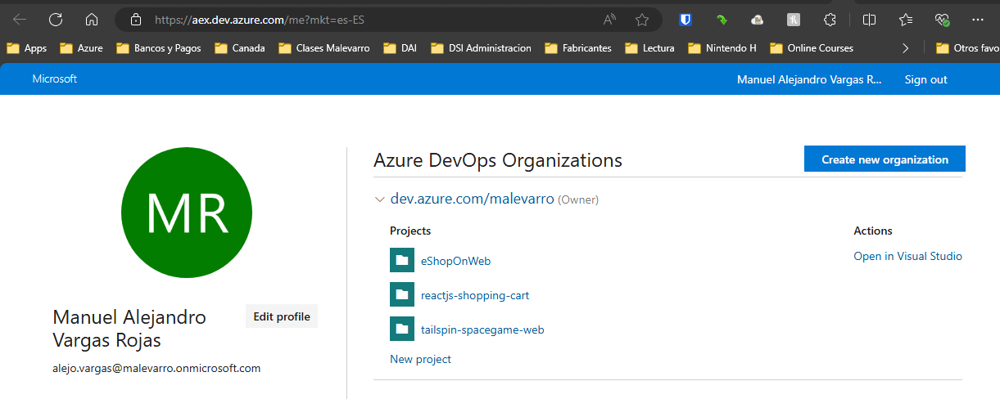

7. Una vez haya ingresado a la organización, siga los pasos en la siguiente [guía](https://www.devjev.nl/posts/2022/how-to-create-a-new-project-in-azure-devops/) para realizar la creación de un proyecto.

---

### Activar paralelismo

Siga el procedimiento descrito en la siguiente [guía](https://k21academy.com/microsoft-azure/how-to-enable-parallelism-in-azure-devops/)

---

### Instalación de extensiones en Azure DevOps

Por medio de la siguiente guía se realizarán los pasos necesarios para la instalación de las extensiones en Azure DevOps utilizados en los laboratorios.

[Instalar extensiones en Azure DevOps](https://learn.microsoft.com/es-es/azure/devops/marketplace/install-extension?view=azure-devops&tabs=browser)

Las extensiones requeridas en el laboratorio son las siguientes:

| Nombre | URL |
|---------|---------|
| Mend Bolt | <https://marketplace.visualstudio.com/items?itemName=whitesource.whiteSource-bolt-v2> |
| Snyk Security Scan | <https://marketplace.visualstudio.com/items?itemName=Snyk.snyk-security-scan> |
| SonarCloud | <https://marketplace.visualstudio.com/items?itemName=SonarSource.sonarcloud> |
| Trivy | <https://marketplace.visualstudio.com/items?itemName=AquaSecurityOfficial.trivy-official> |

Al finalizar la instalación de las extensiones, deben aparecer de la siguiente forma:

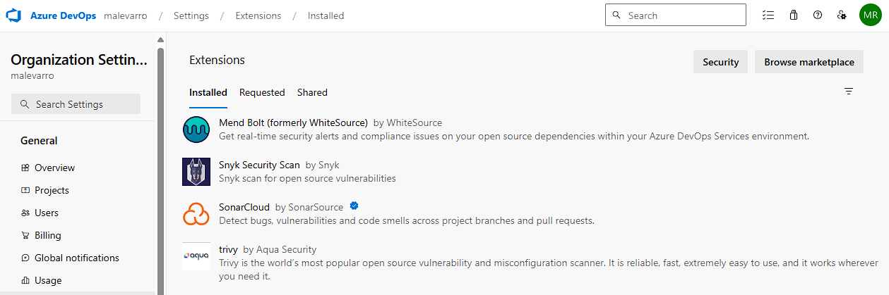

---

### Establecer Service connection Con Azure

Después de realizar la creación de un nuevo proyecto en Azure DevOps se deben realizar los Service connections hacia las demás aplicaciones.

Seguir las instrucciones indicadas en el siguiente manual de [Administrar conexiones de servicio](https://learn.microsoft.com/es-es/azure/devops/pipelines/library/service-endpoints?view=azure-devops&tabs=yaml). Se deben establecer las siguientes Service Connections

1. Siga los pasos de la siguiente [guía](https://www.devjev.nl/posts/2023/how-to-create-a-new-azure-service-connection-in-azure-devops/#how-to-create-a-new-azure-service-connection-in-azure-devops) para la integración de Azure DevOps con el portal de Azure y se permita la creación de componentes en la nube.

---

## Procedimiento

Realizar el siguiente conjunto de actividades para el desarrollo del laboratorio.

> __Nota:__ Recuerde documentar por medio de pantallazos la ejecución de las diferentes actividades con el fin de realizar un documento que quede como evidencia del trabajo en equipo. Este documento es el que deberá ser cargado en el espacio de Google Classroom provisto para ello.

---

### Laboratorios de seguridad

#### Configurando elementos de Azure

1. Vaya a [Azure Portal](https://portal.azure.com) e inicie sesión.
2. Seleccione el Cloud Shell en la barra de menús y, a continuación, seleccione la experiencia de Bash.


> __NOTA:__ Cloud Shell necesita un recurso de Azure Storage para conservar los archivos que se creen en Cloud Shell. Al abrir Cloud Shell por primera vez, se le pedirá que cree un grupo de recursos, una cuenta de almacenamiento y un recurso compartido de Azure Files. Esta configuración se usa automáticamente para todas las sesiones de Cloud Shell futuras.

3. En la termina _Bash_ abierta defina la zona _eastus_ como la zona por defecto de la aplicación

```bash
az configure --defaults location=eastus
```

4. En la consola ingresar los siguientes comandos

```bash
#---Crear variables
export VID=$RANDOM
export RESOURCE_GROUP=myaksrg-$VID
export WEBAPP_NAME=myk8sapp-$VID
export LOCATION='eastus'
export ACR_NAME=myacr$VID

#---Verifique variables
echo $VID
echo $RESOURCE_GROUP
echo $WEBAPP_NAME
echo $LOCATION

#---Crear recursos
#Grupo de Recursos
az group create --name=$RESOURCE_GROUP --location=$LOCATION

#---Creando Azure Container Registry (ACR)
echo "Creating ACR..."
az acr create -n $ACR_NAME -g $RESOURCE_GROUP --sku basic
az acr update -n $ACR_NAME --admin-enabled true

#---Obtener credenciales de acceso
export ACR_USERNAME=$(az acr credential show -n $ACR_NAME --query "username" -o tsv)
export ACR_PASSWORD=$(az acr credential show -n $ACR_NAME --query "passwords[0].value" -o tsv)

#---Crear el App Service Plan (ASP)
az appservice plan create -g $RESOURCE_GROUP -n $WEBAPP_NAME --is-linux --sku B1

#---Crear el Web App Service
az webapp create --resource-group $RESOURCE_GROUP --plan $WEBAPP_NAME --name $WEBAPP_NAME --deployment-container-image-name $ACR_NAME.azurecr.io/webspacegame:latest
#az webapp config container set --docker-custom-image-name nginx --docker-registry-server-password $ACR_PASSWORD --docker-registry-server-url https://$ACR_NAME.azurecr.io --docker-registry-server-user $ACR_USERNAME --name $WEBAPP_NAME --resource-group $RESOURCE_GROUP

#---Validar el despliegue del Web App Service
az webapp list --resource-group $RESOURCE_GROUP --query "[].{hostName: defaultHostName, state: state}" --output table

#---Validar Web App Service
az webapp config container show --name $WEBAPP_NAME --resource-group $RESOURCE_GROUP

#---Validar estado del Azure Container Registry
az acr list --resource-group $RESOURCE_GROUP --query "[].{loginServer: loginServer}" --output table

#Listar los valores de las variables
echo "Installation concluded, copy these values and store them, you'll use them later in this exercise:"
echo "-> Resource Group Name: $RESOURCE_GROUP"
echo "-> ACR Name: $ACR_NAME"
echo "-> ACR Login Username: $ACR_USERNAME"
echo "-> ACR Password: $ACR_PASSWORD"
echo "-> Web App Name: $WEBAPP_NAME"


#Verificar componentes creados y activos
az group list -o table
az acr list -o table

```

---

#### Configurando elementos en Azure DevOps

1. En Azure DevOps, en la pantalla inicial haga click en _Nuevo Proyecto_

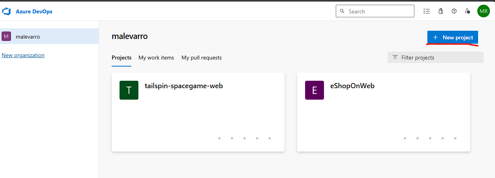

2. Ingrese el nombre del proyecto, seleccione la opción de _Privado_ y las demás opciones por defecto. Finalmente haga click en el botón de _Crear_

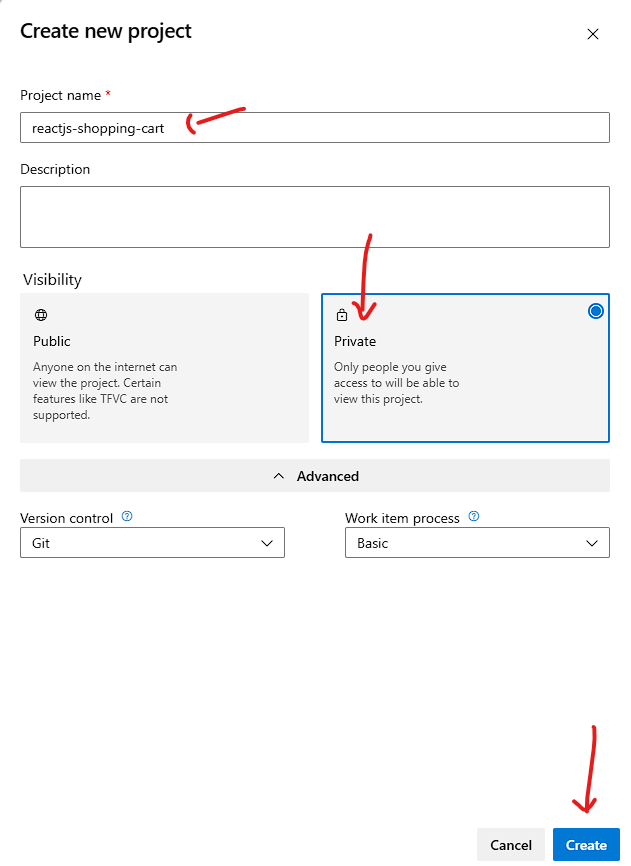

3. En Pipelines (Canalizaciones), Seleccione Biblioteca

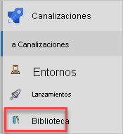

3. Seleccione + Grupo de variables.
4. En Propiedades, escriba __Mis_Variables__ como nombre del grupo de variables.
5. En Variables, seleccione + Agregar.
6. Para el nombre de la variable, escriba WEBAPP_NAME. En cuanto al valor, escriba el nombre de la instancia de App Service que creamos antes, por ejemplo, myk8sapp-32321
7. Repita el proceso para agregar otra variable denominada ACR_NAME con el valor del servidor de inicio de sesión de Azure Container Registry, como myacr32321.azurecr.io
8. Haga click en el botón de guardar
9. Seleccione Permisos de pipelines(canalización) y, luego, el signo de los tres puntos seleccione la opción de acceso abierto y confirme la opción

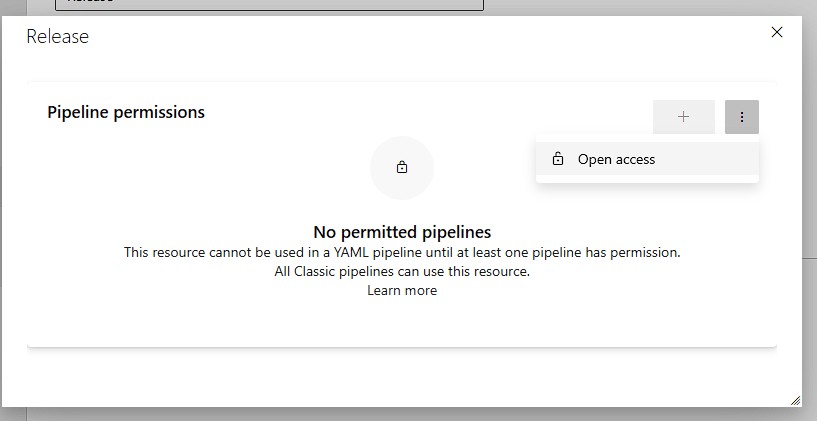

10. Seleccione Guardar en la parte superior de la página para guardar las variables en caso de esta habilitado. El grupo de variables debe ser similar a lo que se muestra a continuación:

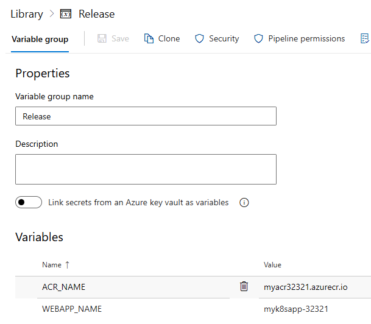

---

#### Establecer Service connection Con Azure

Después de realizar la creación de las variables en el proyecto de Azure DevOps se deben realizar los Service connections hacia otros servicios adicionales

1. En Azure DevOps, vaya al proyecto web que creo anteriormente
2. En la esquina inferior de la página, seleccione Configuración del proyecto
3. En Pipelines (Canalizaciones), seleccione Conexiones de servicio.

---

##### Azure Container Registry (ACR)

1. Seleccione Nueva conexión de servicio, después Registro de Docker y, por último, Siguiente.
2. Cerca de la parte superior de la página, seleccione Azure Container Registry.
3. Rellene estos campos:

| Campo | Value |
| --- | --- |
| Subscription | Su suscripción de Azure |
| Azure Container Registry | Seleccione la instancia que creamos antes |
| Nombre de conexión de servicio| Container Registry Connection |

1. Asegúrese de tener seleccionada la opción Conceder permiso de acceso a todas las canalizaciones
2. La configuración debe quedar de la siguiente manera:

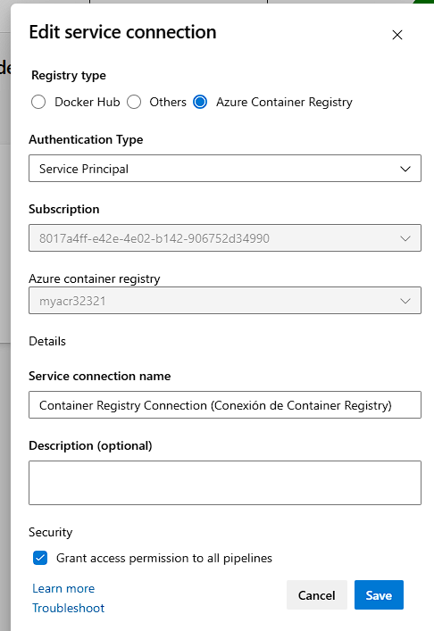

6. Cuando haya terminado, haga clic en _Guardar_

Seguir las instrucciones indicadas en el siguiente manual de [Administrar conexiones de servicio](https://learn.microsoft.com/es-es/azure/devops/pipelines/library/service-endpoints?view=azure-devops&tabs=yaml). Se deben establecer las siguientes Service Connections

---

##### GitHub

1. Seleccione Nueva conexión de servicio, después _GitHub_ , por último, Siguiente
2. Seleccione la opción de  _Grant authorization(Conceder autorización)_
3. En la opción de _OAuth_ seleccione la opción de _AzurePipeline_
4. Haga click en el botón de Autorizar
5. Autentique su cuenta de GitHub normalmente
6. Asegúrese de tener seleccionada la opción Conceder permiso de acceso a todas las canalizaciones
7. La configuración debe quedar de la siguiente manera:

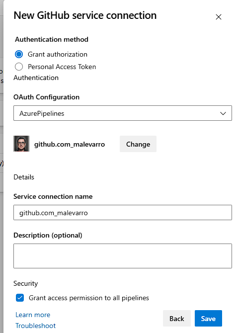

8. Cuando haya terminado, haga clic en _Guardar_

---

##### Snyk Secure Scan

Ejecute los pasos indicados en la siguiente [guía](https://docs.snyk.io/scm-ide-and-ci-cd-integrations/snyk-ci-cd-integrations/azure-pipelines-integration/install-the-snyk-extension-for-your-azure-pipelines)

Para el paso 1 de la guía tenga en cuenta la siguiente pantalla

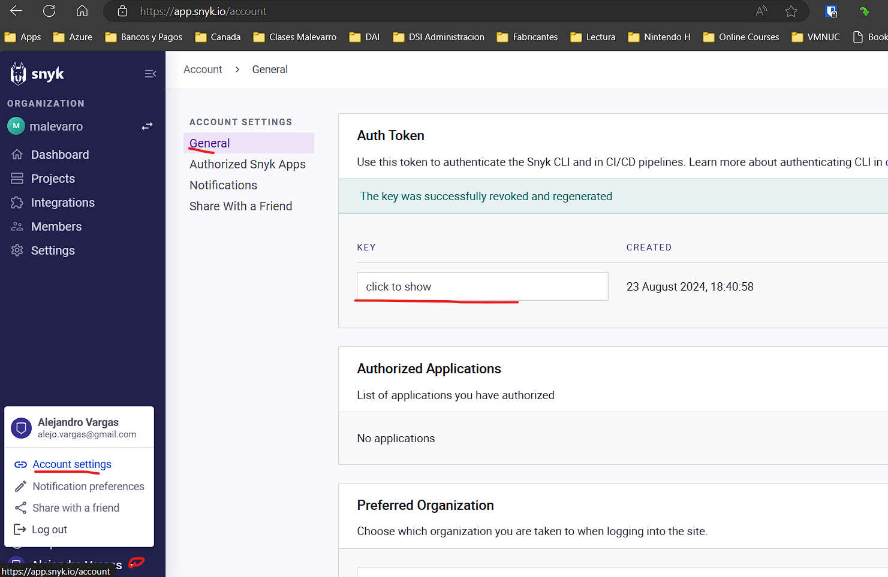

---

##### SonarCloud

1. Abra la consola de [SonarCloud](https://sonarcloud.io/login)
2. Ingrese con su cuenta de GitHub
3. En la esquina superior derecha seleccione el icono que aparece y la opción de _My Account_

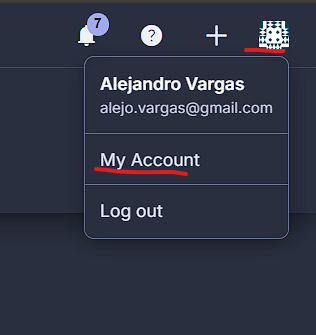

4. En la página, vaya a la sección de _Security_ , Luego en el espacio indicado coloque algún nombre y haga click en el botón de _Generate Token_. En la parte inferior aparece un valor, usted debe copiarlo para usarlo mas adelante.

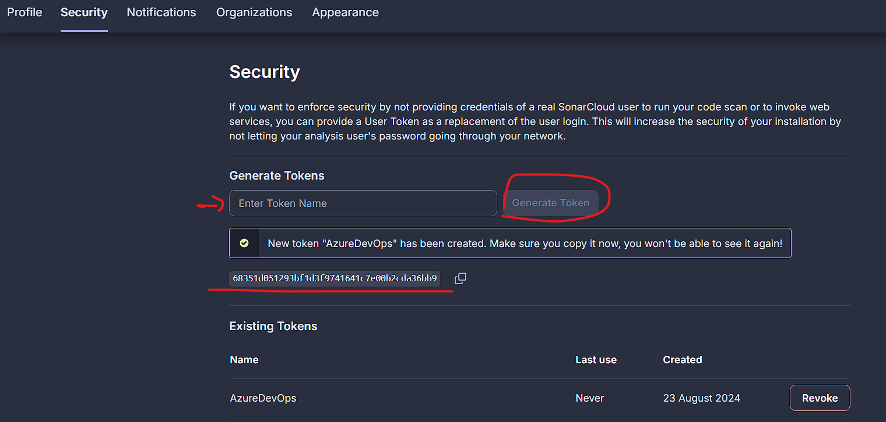

5. Vaya a Azure DevOps, en la parte de _Service connections_
6. Seleccione Nueva conexión de servicio, después _SonarCloud_ , por último, Siguiente
7. En el campo de _SonarCloud Token_ pegue el valor del token obtenido en pasos anteriores
8. Haga click en el botón _Verificar_ y valide que tenga una respuesta satisfactoria
9. Coloque un nombre a la conexión
10. Asegúrese de tener seleccionada la opción Conceder permiso de acceso a todas las canalizaciones
11. La configuración debe quedar de la siguiente manera:

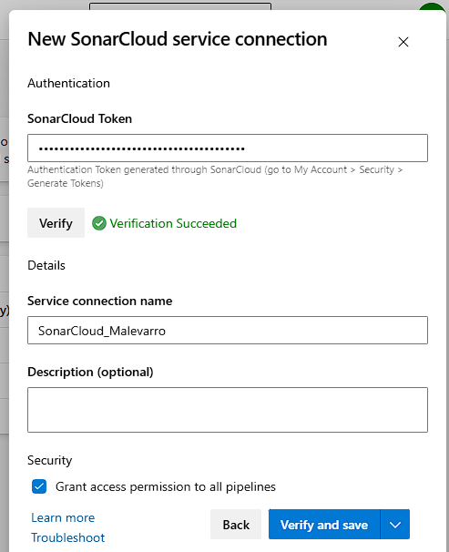

12. Cuando haya terminado, haga clic en _Guardar_

> __Nota:__ Al finalizar la configuración de todas las conexiones usted debe terminar con una tabla como la siguiente:
> 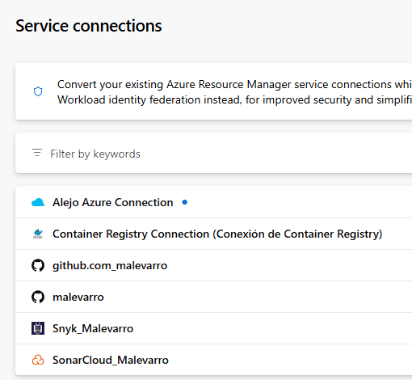

---

### Adicionando variables de conexiones

1. En Pipelines (Canalizaciones), Seleccione Biblioteca
2. Haga click sobre el conjunto creado anteriormente, denominado __Mis_Variables__
3. Adicione variables correspondientes con los nombres de las conexiones de servicio que creamos en los pasos anteriores.
4. Al finalizar, el grupo de variables debe quedar de la siguiente manera

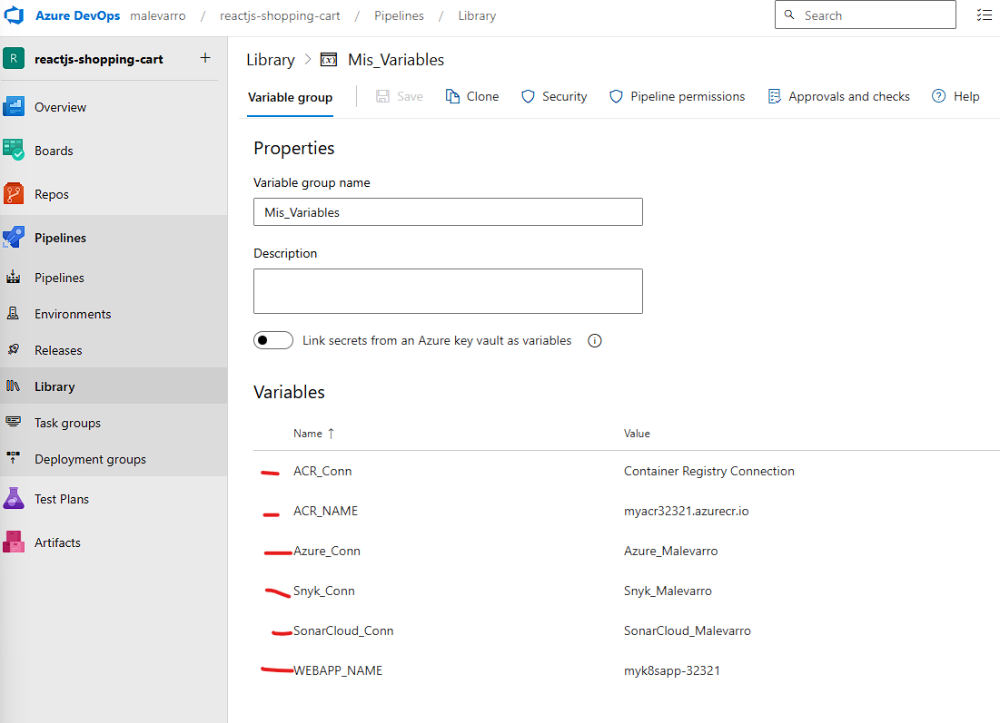

### Creando mi primer _Pipeline(Canalización)_

1. Vaya al proyecto creado en Azure DevOps, haga click en _Pipelines(Canalizaciones)_ y luego en la opción de _Create Pipeline_

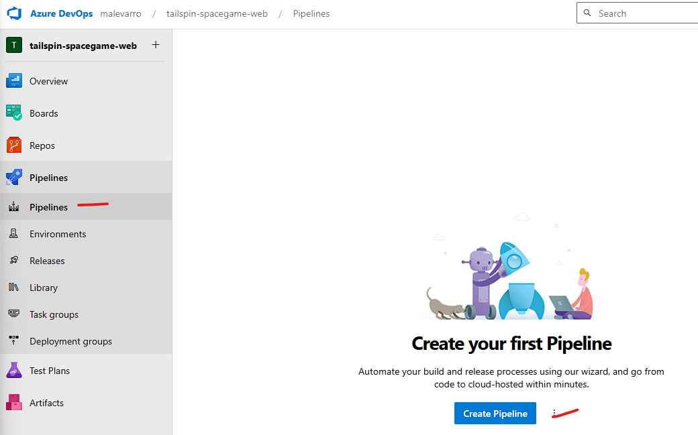

2. En la siguiente ventana, seleccione la opción de GitHub que es donde debió habar cargado el código de la aplicación al inicio con la opción de _fork_ 

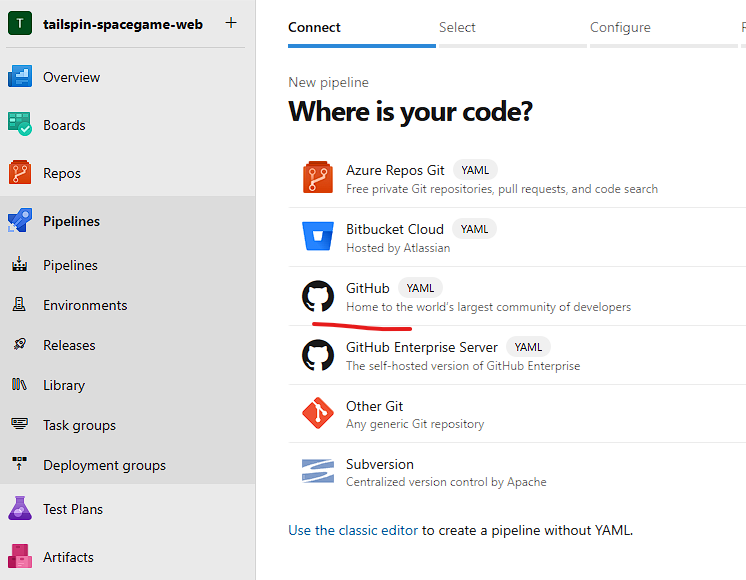

3. Seleccione el repositorio que incluye en el nombre _reactjs-shopping-cart_

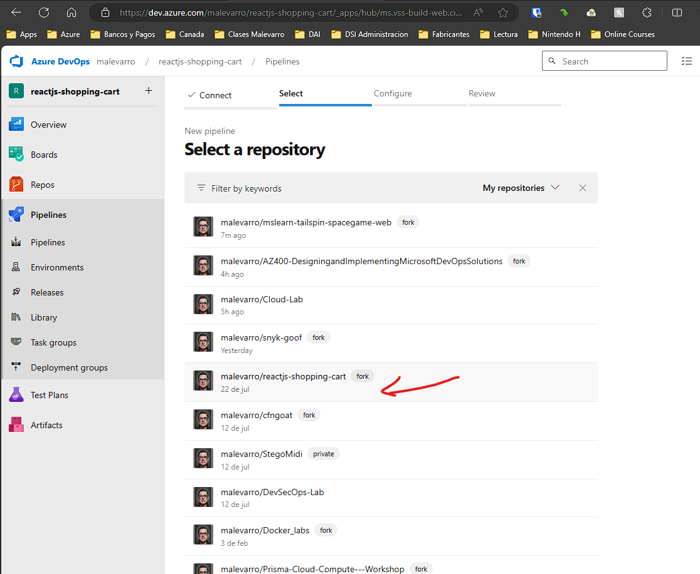

4. En la Ventana que aparece Seleccionar la opción de _Archivo YAML Existente_

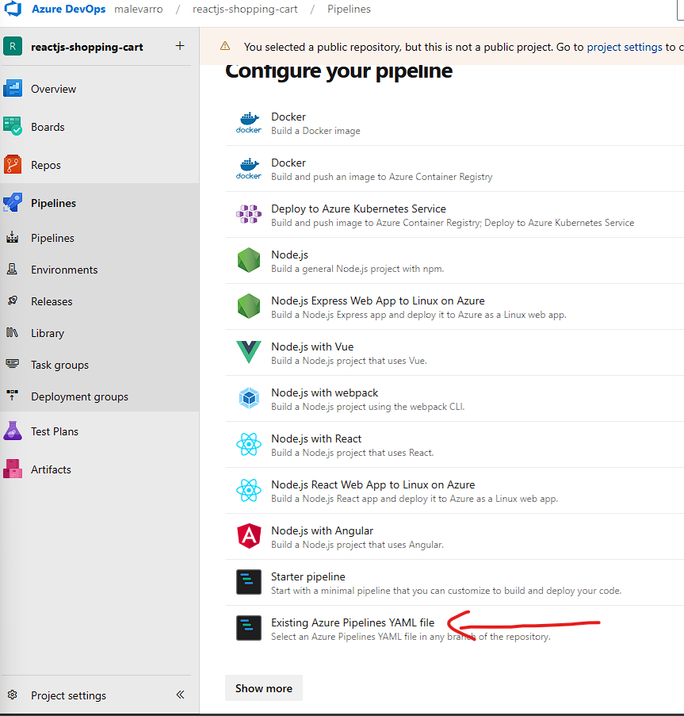

5. En la siguiente ventana seleccione el _Branch_ de __master__ y en _Path_ seleccione el archivo __azure-pipelines-Docker Build.yml__.Luego haga click en _Continuar_

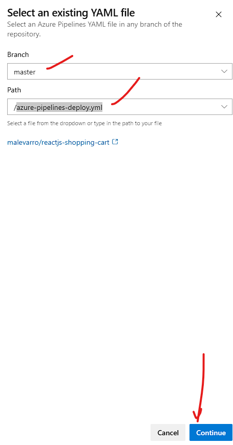

6. Verifique el contenido del archivo YAML. Identifique los elementos principales de la compilación de la aplicación

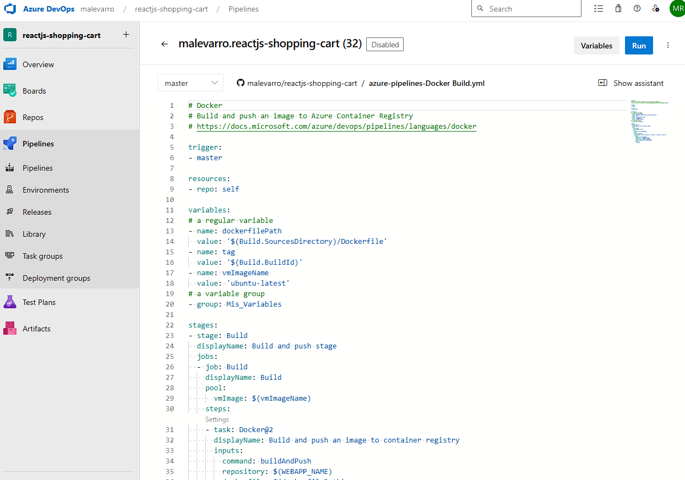

7. Cargue uno a uno los siguientes archivos de configuración de Pipelines para que vea los resultados
   1. azure-pipelines-deploy.yml
   2. azure-pipelines-mend.yml
   3. azure-pipelines-snyk.yml
   4. azure-pipelines-SonarCloud.yml
   5. azure-pipelines-checkov.yml
   6. azure-pipelines-trivy full.yml
   7. azure-pipelines-fullscan.yml
   8. azure-pipelines-devsecops.yml

> __Nota:__ Tener cuidado con la configuración de SonarCloud